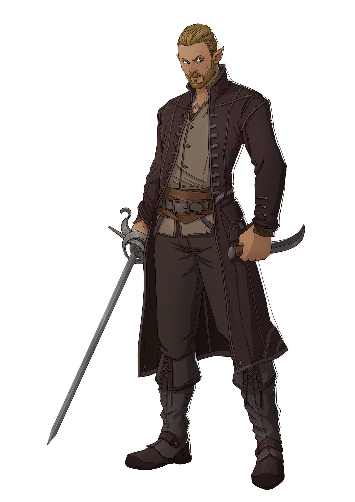
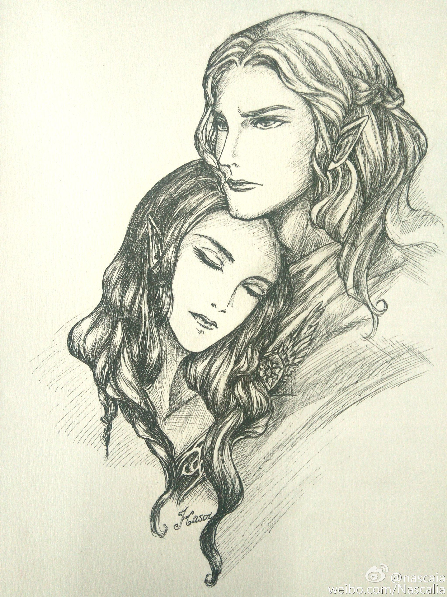

# Aeren Holimion (Diamonddew)

[DnDbeyond.com link](https://www.dndbeyond.com/characters/48920898)

{:width="300px"}

## Appearance Details

- Alignment: Chaotic Neutral
- Gender: Male
- Eyes: Hazel
- Size: Medium
- Height: 5'8" (172 cm)
- Weight: 104 lbs (47kg)
- Age: 121
- Faith: None (I only believe in my own actions and determine my own destiny)
- Hair: Light Brown (well kept full beard)
- Skin: Tan
- Home: No real home, grew up in the streets of **Sharn**

## Characteristics

### Traits

I hide scraps of food and trinkets away in my pockets.
I sleep with my back to a wall or tree, with everything I own wrapped in a bundle in my arms.

### Ideals

People. I help the people who help me — that’s what keeps us alive.

### Bonds

I owe my survival to another urchin who taught me to live on the streets.

### Flaws

It’s not stealing if I need it more than someone else.

## Profession

Thief / Assassin for hire. Potentially can get away as a spy or a court jester.

## What did I do during the last war?

During the last war I served as a spy for **House Phiarlan**. I infiltrated several factions and providing all of them information about their rivals. I found out that all the houses are the same. None of them can be trusted they all have hidden agendas.  
During one of my missions I was held captive. Luckily I was rescued by house agents of **House Cannith**. Ever since they made several requests for my services.
I have no allegiance to a specific House, although **House Phiarlan** and **House Cannith** do provide me with more jobs than the others.

## How did I get called into action?

Enig idee **Sam**? Ik ben een thief/assassin for hire dus ik neem aan gewoon ingehuurd door **Elaydren d'Cannith**?

## How did my dragonmark manifest?

During my childhood, **Gennal** and me tried to do a jewel heist in the city.  
During the heist we were about to get caught overwhelmed with anxiety and stress, my dragonmark formed and allowed me to become completely invisible right in front of the shopkeepers eyes.  
We managed to pull of the heists but my acts did not go unnoticed. Shortly after I was contacted to join **House Phiarlan**.

## Family

I never knew my parents.  
I have a drawing of what they told me are my parents. (**Lucian** and **Rayla Holimion**)

{:width="300px"}

## Friends

Grew up on the streets together with other orphans:
- **Bethrynna Caerdonel**
> Neutral Evil Elf Wizard that works as an Adventurer. She is alive and quite successful.
- **Gennal Mellerelel**
> Neutral Elf Rogue that works as a Thief. He is dead, killed during a heist.
He thaught me to survive on the streets. Stealing food, putting up shows, begging. We even went on some heists together. I later found out he was killed during a heist when I left the citry already.
- **Theirastra Fasharash**
> Neutral Elf Ranger that works as a forest keeper. She is alive, but doing poorly due to injury.
- **Aelar Mellerelel**
> Lawful Good Elf Cleric that works as a Priest. He is alive and well.
- **Laucian Cithreth**
> Neutral Good Elf Sorcerer that works as an Academic. He is alive and well.

## Events

### Started dating.

Claire Addington, Lawful Good Human Cleric that works as an Artisan. Our relationship was passionate but short because I had to leave for the last war.  
She is alive, but doing poorly due to finances. She disspeared without a trace after the last war.

### A heist went wrong

I nearly died. I have nasty scars on your body (hidden by my clothes), and I am missing a finger (left ring finger) due to torture.  
I got caught while my companions made it out. The guards tortured me for information (I did not yield).

### Tragedy during the last war

My lover disappeared without a trace. I have been looking (albeit passively) for that person ever since.

### Tragedy after the last war

I was imprisoned for a crime you didn't commit and spent 2 years in jail.  
They charged me with murder of a guard in a jewelry store. It was one of the other thiefs that did it.  
They all pinned it on me.

### Made a friend

Mary Alton, Neutral Good Human Druid that works as an Artisan. She is alive and well.  
Always had a place for me to stay when I visited her. Runs a herb/flower shop.

### Made an enemy

Bundrigo Hilltopple, Neutral Halfling that works as a Innkeeper. He is alive and quite successful.  
I caused several bar fights in his inn while staying there.

### Made an enemy

Soveliss Xiloshem, Neutral Elf Barbarian that works as an Artisan (Blacksmith). He is alive, but I haven't heard from him in a while.  
I once stole daggers from his weapon shop. He swore to take his revenge.

Links:
[Aerenal](https://www.dndbeyond.com/sources/erftlw/khorvaire-gazeteer-distant-lands#Aerenal)
[Mark of Shadow](https://www.dndbeyond.com/sources/erftlw/character-creation-dragonmarks#TheMarkofShadow)
[Phiarlan](https://eberron.fandom.com/wiki/House_Phiarlan)
[Chaotic Neutral](https://mykindofmeeple.com/chaotic-neutral-alignment/)
