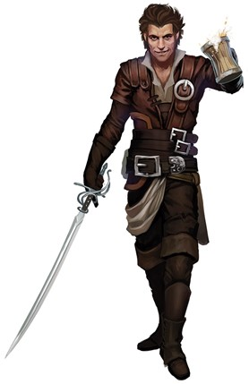

# Beren Holimion (Diamonddew)

[DnDbeyond.com link](https://www.dndbeyond.com/characters/48920994)

{:width="300px"}

## Appearance Details
-	Alignment: Chaotic Neutral
-	Gender: Male
- Eyes: Hazel
- Size: Medium
-	Age: 111
-	Faith: None (Who needs faith?)
-	Hair: Dark Brown
-	Home: Wherever my next target is.
 
## Characteristics

### Profession

Thief / Spy / Assassin for hire

## What did I do during the last war?
I fought during the last war, just as a solider for house X. I met the one love off my live on the battlefield, she saved my life.. Later she died in the same bloody war.   
After the war, I sought out the little family I had. They were all criminals, spies, thiefs and I followed in their footsteps. I had a few issues dealing with the fallout of the war. Drinking was one of them.  
I met my nephew Aeren in X, it was a strange reunion, but since the first job we did together, I started trusting him with my life. I introduced him to my mother and sister and between jobs, we keep looking for the others.

## How did I get called into action?
Up to Sam

## Family
My mother is alive, living in X, together with my little sister. Father died a few years ago but did tell me some of the family was still alive. So I have more family in this world than I know off.

## Friends
I don’t make friends easily, I see them more as useful contacts, but trust is not an easy thing to obtain.
