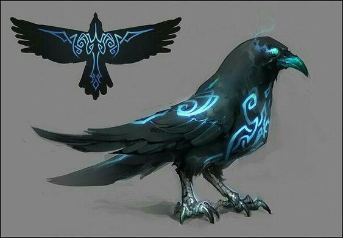

# Orwin Haskal d'Sivis

[DnDbeyond.com link](https://www.dndbeyond.com/characters/31318304)

{:width="300px"}

## Familiar

Raven (**Tal**)

{:width="300px"}

## Appearance Details

## Profession

A **cartographer**, who tries to map the world after the *Last War* / *Day of Mourning*.  
Since the house **d'Sivis** specializes in communication and is actually also a bit of a notary, it is a task for them to check that all deeds are not yet "OK" and whether changes need to be made.

## Occupation during the Last War

During the *Last War*, he was called upon to operate one of the many talking stones and pass on important messages.   
Because of this, he has a well-stocked "phone book" with many of the talking stone number scattered around **Khorvaire**.

## Religion

His divination magic comes from worshiping and seeking advice from:  

**Aureon**  
*Knowledge, law, magic, power, spirit, oracle, spell*

**Aureon** is the legitimate neutral deity of knowledge and magic. He is the brother of **Onatar**, the husband of **Boldrei** and the origin of the **Shadow**. His domains are Knowledge, Law and Magic, and his weapon of choice is the Quartermaster Staff.
