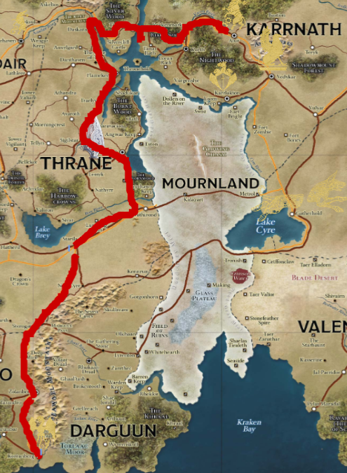

# Session 17 Raw Notes

## Recap:

Achtervolging van **Lucan Stellos** die met een zwaard (**Vampire Blade**) een gevecht gestart was op het bal.

Bij het achtervolgen in aanraking gekomen met de **Trusts**.

**Lucan** en zijn zus (**Grilsha**) bespreken een plan om te vluchten.

We beginnen een gevecht met de guards om ze te overtuigen dat we hem na moeten gaan.

**Tash** en **Orwin** gaan neer. **Lily** onderhandelt om hen mee te nemen naar de ambassade.

## Bewusteloos

We hebben een bank gekregen in de ambassade om bij te komen.
**Tash** = 4u Bewusteloos
**Orwin** = 2u Bewusteloos

## First hospital, pursuit later

Als ik ontwaak, vraag ik wat er gebeurd is.  
We hebben tegen de guards verloren.  
**Lily** wil de persuit inzetten, ik stel voor om langs de verplegerspost van **House Jorasco** te gaan.

Hier kunnen ze ons misschien oplappen alvorens we de achtervolging inzetten?

De **Trusts** vinder het niet verdacht dat we bewusteloze **Tash** meenemen richting het hospital.

We vragen een lijst op van prices/services om ons te healen.

Ik bestel 6 cure wounds voor **Tash** en **Mezelf**, dit kost me *150 gp*. (24 voor mezelf en 32 voor **Tash**)

Er wordt een persoon bijgeroepen.  
Vrouwlijke half-ling met het embleem van **House Jorasco**.  
Doet een handoplegging en gebruikt haar **Greater Dragonmark** om ons te healen.

**Lily** is op zoek naar spellslot potions.  
Hier kunnen ze ons niet mee helpen.

| #   | Dice Roll |
| :-: | :- |
| 1     | 10      |
| 2       | 2      |

## Pursuit (in disguise?)

Ze hebben ons herkend toen we hen achtervolgde en vochten tegen de guards.  
Kunnen we ze achtervolgen?  
Is riskant misschien toch maar niet proberen.

Trein gaat door:  
Thrane -> Karrnath rond de mourneland

Waarom zou ik iets geven om het zwaard.  

Plan:
1. Trein opstappen.
2. Resten tot eerste stop.
3. We houden hen in de gaten als ze afstappen.

## Trainstation

Er is al vrij veel bedrijvigheid.

We gaan een kaartje kopen.  

| klasse     | prijs   |
| :------------- | :------------- |
| Geen slaapplaats | 3cp/mile |
| Gewoon      | 2sp/mile      |
| 1ste klas | 5sp/mile |

Table ticket to Flamekeep: 2000 miles (60gp)

We kunnen gewoon richting de trein gaan.

## All aboard!

We stappen in onze wagon, is echt een zwijnenstal.
We zitten tussen de goblins, ...  
Het stinkt er heel fel en er zit zelfs livestock op de trein tussen de passagiers.  
Het is er heel druk.

De trein komt langzaam in beweging en zoeft het station uit.

1600km/day = 66km/u . (valt wel mee voor een "**lightning rail**")  

We zitten eerder naar achter.  

**Lily** probeert te slapen.
**Tash** en ik ga op zoek naar de wagon van **Lucan**

Af en toe komt er iemand met een **House of Passage** uniform om te controleren of alles in orde is en iedereen in zijn (lage) klasse zit.

### North wagon 1

2de klasse, we zien een hoop deuren, allemaal gesloten.

Tash cast:  

  Locate Object

### North Mesh Hall

Human (gekleed als soldaat) is daar vanalles tegen aan het zeggen en de half-lings zijn aan het koken.

Als we dichterbij komen horen we dat hij aan het opscheppen is tegen de half-lings.  
Hij is vrij jong (18) en zegt dat de oorlog er ander uit zou gezien hebben als hij mee deed.

**Lilly**: "Is there some dining place near here?"
Meestal eten ze in hun rooms, "the scraps" eten het meestal achter in de dining area.

### North Lounge

Begint te lijken op eerste klasse vanaf hier.  
Stoelen gevuld met mensen die ons met "minachting" bekijken.

### North Gang met deuren

Gevoel dat we in eerste klasse zijn aangekomen.  
De temperatuur is aangenamer.  
Mooier hout.  

**Tash** voelt dat de richting van het zwaard verandert terwijl hij voorbij de cabines loopt.  

We weten dat het zwaard nog hier is.   

**Lily** stelt voor dat ik een alarm op de deur plaats op de deur die **Tash** aanwijst.  

  Alarm

Terwijl ik sta te casten, komt er een jonge gnome vrouw buiten.  
Ze spreekt me aan?  

Ik herken haar. (ze heeft een embleem van House d'Sivis aan)  
**Tash** doet een poging.  
Ik heriner me haar. (Heet **Evyn d'Sivis**)  
Jonge scribe, heeft vroeger nog, toe nik in Corranbergh zt heeft ze lessen van mij gevolgd om cartography te volgen.  
Ze is aangesteld tot de nieuwe main cartographer van Sharn.  
Ze moet de stad in kaart brengen.  

Waarom ben ik dat niet meer?  
Nieuwe job, als freelancer.  
Vreemd dat ik geen fund heb gekregen voor mijn travels nu.  

"Grandmother doesn't pay" - **Lily**  
**Evyn** is volledig verward door de opmerking van **Zap/Lily**.  
**Lily** probeer het te negeren, maar een lage deception roll geeft haar weg.

Parents? Zo een suit komt toch van een creation forge?  
Is alles in orde?

Ik ga mee naar haar "room".  
Ik stel **Tash** en **Zap** voor als mijn bodyguards, zij gaan de wacht houden.   

Ze is volledig onder de indruk van mijn aanwezigheid en het in kaart brengen van de **Mourneland** (als eerste cartographer?).

Ze heeft een human vrouw gezien, maar geen man.  
Met **Evyn** afgesproken om me op de hoogte brengen als er iets speciaals aan de hand is (via message).

Ik:

  Alarm

 Insight Check: 2

Terwijl ik sta te casten komt er een vrouw buiten.    
Ik ga te hard op in mijn spell en heb nie door wie het is.

  
Lily

  
Herkent haar als Neya?

De vrouw vraagt wat ik aan het doen ben.  
Ik vertel dat ik de trein aan het warden ben.  
Om ervoor te zorgen dat alles nog veilig is.  

 Deception Check: 17

Gelijkspel

 Deception Check: 14

Ze heeft door dat ik de train niet aan het warden ben.  
Ze wil dat ik haar privacy respecteer.  

**Lily** roept "Neya", ze kijkt geschrokken naar de andere kant van het geluid, want ze denk dat **Neya** eraan komt.  

**Lily** zegt dat ze haar herkent als **Neya**, maar ze ontkent dat ze **Neya** is.

Ik drop mijn spell en wandel weg, ze volgt niet en keert terug naar haar kamer.

We worden gesnapt door guards en moeten terug naar onze "hoogwaardige" plaatsen.

## Dinner time

Veel mensen gaan richting de keuken om het eten op te halen en ergens te gaan eten.  
Ook veel mensen uit onze wagon die ernaar toe gaan.  
Het is een heuse stormloop.

Ik ga eten halen.  

## Night time

De avond valt, we kunnen niet binnensluipen.  

We gaan proberen te slapen.  

 Constitution Save: 21

We vallen allemaal in slaap, we zijn veel te moe.  
In het begin van de nacht (na ongeveer een uur):  

**Evyn** stuurt een message:
Iemand heeft iets onder de deur van **Neya**? geschoven.  
Een verdacht figuur.  

We onderbreken onze rest en gaan kijken wat er aan de hand is.

## Investigation

We horen iemand vragen: "So who are you? What are you doing here, why did I need to meet you"

Male voice.

Herkennen we ze?  
Ja, het is de stem van: **Lucan**

De deur is op slot.  
Ik heb niks bij om het te lockpicken.

Ze horen me de deur proberen open doen, maar geen reden tot paniek.  

**Tal** kan langs de train blijven vliegen om het gesprek mee te luisteren:  
Het is een gesprek tussen: **Garrow** en **Lucan**.

L: I didnt think you would be a vampire.  
G: I chose this form to make you feel comfortable.

L: So, you were going to get me into **Karnath**. Can you get us save? Me and my sister.  
G: Yes

L: What is in this for you?  
G: Well its always nice to have a friend and someone powerful to join forces with.

L: Alright then.  I am glad that I have someone to help me.  
G: Of course, if there is anything you need we will talk.

**Lucan** voelde zich heel ongemakkelijk.

We verstoppen ons voor **Garrow**.  
Hij krijgt die deur wel open?

Thrall = Slaaf van vampier?

- Heeft **Lucan** zijn thrall zijn al ongedaan gemaakt?
- Is **Lucan** sterker dan **Garrow**?
- Wil **Garrow** een ally?

**End of Session**
