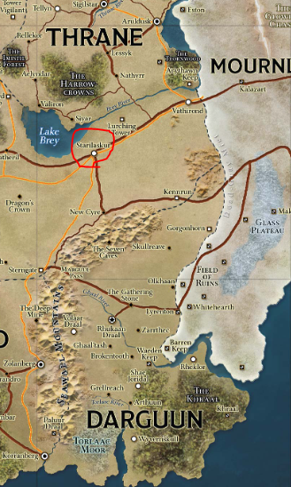

# Session 18 Raw Notes

## Recap:

De targets (Grilsha en Lucan) zitten op een trein.  
Ze hebben de vampire blade mee.

Na een dag hen in de gaten te houden, horen we 's avonds kabaal.  
We sluipen dichterbij en kunnen een gesprek afluisteren tussen **Garrow** en **Lucan**

Vragen:
- Heeft **Lucan** zijn thrall zijn al ongedaan gemaakt?
- Is **Lucan** sterker dan **Garrow**?
- Wil **Garrow** een ally?

**Garrow** is onze vijand om de erfstukken te vinden.

## Continue on our train journey

We verstoppen ons voor **Garrow**, dat lukt.  
We horen niemand meer.  
We komen uit onze hiding places.

ik ga terug naar de kamer van de gnome.  
Ik gebruik **Tal** om **Lucan** en **Grilsha** in de gaten te houden.

 Perception Check: 22

Een gesprek kan ik afluisteren.  

G: Wat wilt **garrow**?  
Gaat hij ons helpen?  

afstandelijk en ontwijkend  
L: **Garrow** wil meer dan hij laat merken.  
Ik voel me niet zo comfortabel om met hem te werken na de vorige keer met de andere vampier.  

 Insight Check: 8

Ik kan niet uitmaken hoe ze zich voelen.  

G: Als ge het niet vertrouwt, ga er dan niet mee door en blijf op u hoeden. Ik zal je beschermen.  
L: Bedankt

**Grilsha** gaat slapen. **Lucan** blijft wakker?  

**Tal** houdt de wacht en gaat me verwittigen als er iets in de kamer verandert.  

We houden een long rest. (ofja ik toch, de rest in 3de klas kan geen slaap vatten)

## The next morning

| #   | Roll   |
| :-: | :-     |
| 1   | 7      |
| ~2~   | ~15~ |

**Tal** maakt me wakker.  
Ik zie **Lucan** veranderen in een vleermuis en zich verstoppen in een tas.  

Ik laat iets weten bij **Evyn** en keer terug naar de groep.  
In de keuken staat de opschepper nog uit te leggen over de oorlog.  

Ik passeer een merchant in verzorgde kleren die zich voor me excuseert.  
We passeren mekaar op de gang.  

Ik vervoeg me bij de groep, ik breng hen op de hoogte van wat er zich heeft afgespeelt.  
**Lucan** verstopte zich als vleermuis in een tas.  
**Grilsha** ging hem beschermen.  

Terwijl we staan te overleggen wat we gaan doen is gaan ze het ontbijt serveren.  

We kunnen ons melden bij de kantine.  

Twee figueren passeren ons om te gaan eten.
1. De opschepper / soldaat
2. De frisse/wealthy merchant

Ik zet me naast de soldaat.  
Hij heeft niet in de oorlog gevochten, hij was te jong.  
Als de oorlog er nu nog was, had hij ervoor gezorgd dat **Breiland** was gewonnen.  
WE HADDEN ALLES!  
Te veel lafheid.

Hij had kunnen vechten. Voor 'ons' land hele veldslagen.

Ervaring? Nee, maar hij heeft drive. Hij had een held moeten zijn.  
Een stuk schroot kan een echte krijger te baas? (wijst naar **Zap**)

**Zap** reageert niet.

Kan hij wel iets?

 Insight Check: 3

Hij kan zich goed verkopen.

Hij wordt van job naar job gestuurd.  
Maar de vredestijd is saai voor een soldaat.  
Hij heeft jaren getrained voor iets te doen.  
Maar hij mag nooit mee gaan doen.

Hij ratelt maar door en door.  
Ik laat hem vertellen.

### History Lesson

The last war.
[wiki](https://eberron.fandom.com/wiki/The_Last_War)

**Tash** probeert ondertussen de merchant te mindlinken.  
"Hello"

Geen reactie  

T: "Hello"  
M: "Hello?"

De merchant is confused.  
T: "Ik ben het, de warforged langs je"

De merchant kijkt op.

De merchant zegt dat de warforged hun monden toch bewegen als ze praten?  
**Zap** knikt alleen maar
T: "Maar ik ben altijd al een beetje speciaal geweest"

Hij heeft door dat het **Tash** is en wandelt naar hem toe.

  
Mindlink Tash en de Merchant

  
Wat wil je bespreken? Het is nogal delicaat? Doe maar in de mindlink. Niemand kan ons hier toch horen?

  
Wat verkoop je zoal?

  
Handelaar in zeepswaren, zelf een zeiler.

  
Wat doe je hier op de trein, waar ben je naar onderweg?

  
De bestemming is Karnath/eindbestemming

  
We zoeken iemand voor een job op de trein 

  
Iemand om een oogje in het zeil te houden 

  
We moeten een gnome en 2 humans in de gaten houden 

  
ZE hebben iets op zak waar onze baas in is geinterreseerd 

  
Een diefstal? 

  
Nee meer een terugbrenging

We bieden hem 10gp.  
Hij gaat akkoord

> Hou de figuren in de gaten. Bewegingen, met wie ze spreken, ... Alles wat jij denkt dat nuttig kan zijn.

## Waiting for our spy

**Tash** en **Zap** vallen beide in slaap.
Na een hele dag te wachten komt de merchant de wagon binnen.

| Name | Codename     |
| :------------- | :------------- |
| Tash       | Handler/recruiter       |
| Orwin | Boekhouder |
| Zap | Warforged |
| ? | Merchant |

In de mind-link:  
Wat voor nieuws?  
Niet veel, in de eerste carriage:  
2 gnomes, 2 humans, allemaal female. Een heavily armored one en iemand met casual clothes.  
She keeps to herself.  
Praten heeft geen nut, ze zegt niet veel.  
Ze reist naar *Karnath*, ze spreekt met geen enkele andere passagier.  
Niemand was bij haar, ze lijkt alleen te reizen.  

## First Big Stop

*Starilaskur*, een degelijk grote stad.
Beetje centrumpunt voor *Breland*.
Verschillende soldiers en hobgoblins stappen hier op.
Staat bekent voor de fortresses.

Ik heb het gevoel dat er niet veel mensen afstappen hier.

## Garrow standing in the next cabin

L: "Luister, ik heb door dat ge iets van me wilt. Wat wilt je? En graag duidelij! Geen zin in nog meer hersenspelletjes ik heb er genoeg meegegemaakt"  
glimlacht, kalm  
G: "Weet je goed genoeg, jij hebt de vampire blade, geef me de blade en ik zorg ervoor dat jij en je zus voor de rest van jullie (on)levens in alle rust in Karnath kunnen verderleven. Zonder angst voor Caddius"  

  Insight Check: 14

Lucan kijkt naar hem, alsof hij naar iets luistert en zegt:
"Luister, ik weet dat ge voor de emerald claw werkt en ik ben niet van plan om ooit nog een slaaf te zijn voor de undead. Onze samenwerking eindigt hier! Dankje voor het ticket en laten we hopen dat we mekaar niet meer tegen komen"

Lucan wandelt weg uit de wagon.

**Garrow** is niet pleased. Hij is nogal angry.
Hij stormt op ons af.

**Tash** en ik verstoppen ons.

**Tash** weet zich niet goed te verstoppen, zijn armor rinkelt.  
**Tash** wordt compelled om de deur te openen.  

 Roll for Initiatve

> Jullie domme, domme avonturiers!

**Garrow**

> Als jullie nu iets slimmer waren geweest en me niet voor de voeten hadden gelopen. Ik had de confrontatie niet nodig gevonden, jullie duidelijk wel.

**Garrow**

Tijdens het gevecht verandert hij in mist?
Hier kunnen we niks tegen doen?

  Wand of light

Niks effect

  Spirit Guardians

Niks effect

De mist wordt dunner en verwijnt langzaam.

**End of combat**

Ik ga naar de cabin van **Grilsha** en **Lucan**.

Ik zeg dat we een aanvaring met **Garrow** hebben gehad en dat we weten dat **Lucan** hem kent en we hebben een voorstel voor jullie.
**Grilsha** stuurt **Lucan**.
We kunnen u een leven van vreden geven.
Zodat ge niet meer moet blijven vluchten.
We kunnen u bescherming bieden van house de Sivis.

Hij richt het zwaard naar mij.

  Mirror Image

**Tash** loopt er op af.

  Spirit Guardians

 Roll for Initiatve

**Lucan** wil het zwaard niet geven.
Verandert zelf ook in mist.

Een nieuwe lightning bolt vliegt door de lucht.  
Hij raakt me maar net.  
Zowel **Zap** als ik vallen unconcious neer.

Total party kill

**Tash** en **Orwin** gaan naar House d'Sivis om te rapporteren dat het niet gaat lukken in de opdracht en ze resignen. (NPCs)
