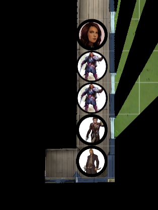

# Session 19 Raw Notes

## Recap

Iedereen is neer gegaan door **Grilsha** haar lightning bolt.  
**Evyn** brengt ons weer bij bewustzijn en neemt ons mee naar haar kamer.

## The backup arrives

We zien de eerste party neergaan.  
**Beren** en ik gaan kijken wat er aan de hand is.

Een kleine gnome doet de deur open.  
We vermelden dat we hun backup zijn en dat ze iets moet laten weten als de party wakker is.

We trekken ons terug naar onze kamers, voorzien van **Cannith**.

## Awakening

Na het beseffen dat hij voor een tweede keer bijna dood is gegaan, willen **Orwin** en **Tash** niet meer verder.  
Ze besluiten om terug naar **Korranberg** te gaan.  
Ze nemen afscheid van **Lily** en wensen haar veel success in het vinden van haar avontuur.  

  
Spoiler Alert (enkel voor Orwin)

  
Bij het aankomen in Korranberg, rapporteer ik het avontuur. En vooral het falen ervan. Waar Lily is en nu naar onderweg is.

## A robot knocks on the door

**Zap** klopt op onze deur. Ze vraag wie we zijn.  
We vertellen haar dat we de backup zijn en haar kuomen helpen.

We komen erachter dat **Orwin** en **Tash** stoppen met de missie en naar **Korranberg** gaan.  

  
No witnesses

  
We moeten van de ooggetuigen af dus die gaan we eerst nog moeten liquideren.

 Insight Check: 14 (Lily)
 Deception Check: 9 (Beren)

**Lily** heeft door dat er iets aan de hand is, omdat we "nog iets af te handelen hebben".  

**Beren** en ik gaan avondeten halen (en onze opdracht afhandelen)

 Perception Check: 17

We horen zwaar gebonk uit de cabine waar **Orwin** en **Tash** zaten.  
We horen twee hobgoblins die **Grilsha** aan het lastigvallen zijn.

 Roll for Initiatve

**Grilsha** raak haar met de chain lightning.  
"I am terribly sorry."  
Terwijl ze het zegt, komt er achter haar een figuur in beeld. "geblinkt".  
Hij heeft 2 daggers in zijn handen en valt **Grilsha** aan vanuit een ongezien positie.

Ze wordt gestoken door 2 messen het bloed spat uit haar rug.  
Aangezien we niet bij de aanvaller kunnen, casten **Beren** en ik invisibility.  
"Nice help" - **Grilsha**

 Investigation Check: 20

De kamer van **Orwin** en **Tash** lijkt haastig opgeruimd en leeggemaakt te zijn. Alsof er net nog iemand is geweest zonet.

Summary of the fight:

**End of the Session**
