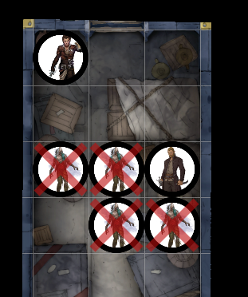
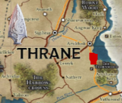
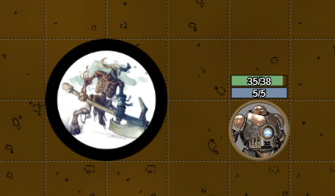
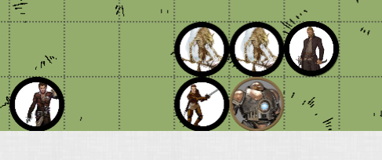
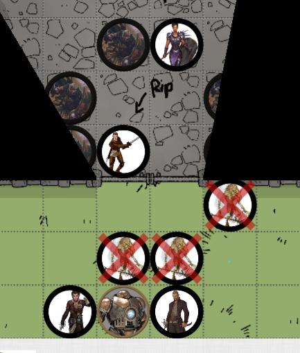

# Session 20 Raw Notes

**Disclaimer**: geen spellcheck of grammar check

## Aftermath of the assassination

Ik probeer de lock te picken van de kamer naast ons.

De deur is gesloten.  
We kunnen niet naar binnen breken.

 Dexterity Check: 16 (Met Thieves Tools)

Niet genoeg, we kunnen de deur niet open doen.

De hobgoblin draagt de Mercenary emblemen van Darguun.

De nacht valt.

We gaan door Thranish landschappen.  
Gigantische cathedralen en kerken zien we in de verte. Omringd door velden en vlaktes.  

**Beren** en ik spreken af dat we nog een missie en een afspraak hebben.    
Die moeten we volbrengen.  
Deze avond doen we nog een poging.

## Zombies?

De handelaar die we hadden ingehuurd, komt de cabine binnengelopen.
"Zombies in de cargohold!"

"Where are the enforcers?" - Aeren
"Die zijn al gestuurd, maar we hebben alle hulp nodig" - Handelaar

We volgen (met enige tegenzin, want dit is niet mijn taak) de man om te gaan helpen.

We komen aan in de cargo.   
Er zijn 4 zombies.

 Roll for Initiatve

## Sudden Stop

De trein komt plotseling tot stilstand.  
Ik en **Zap** vallen op de grond.  
Ik roep dat ze misschien gaan ontsnappen, ik loop naar voor.

**Zap** opent een cargo deur en stapt naar buiten.

Ik kom in de kamer en zie **Grilsha**.

**Emerald Claw** ging hen helpen.  
**Lucan** heeft ontdekt dat ze van de **Emerald Claw** waren.  
Hij werd paranoid en vertelde over freedom.  
Nu hebben ze hem proberen te vermoorden.  
Ze hebben hem gevangen en is nu gaan lopen.

Ze wijst richting een toren in de verte.  
Een vleermuis vliegt in die richting. (**Lucan**)  

Wie weet wat er hem staat te wachten in die toren.  
Hij heeft schuiling nodig voor de zonsopgang.

Het zwaard heeft hij niet meer nodig, maar hij heeft er een speciale band mee.
Ze hebben het nodig en vallen hem daarom aan.

**Emerald Claw** heeft de trein stil gelegd.  

Waar we gestopt zijn:

Het is een vroegere stad.  
Vol met skeletten, veroeste wapens, schilden.  
Duidelijk een slagveld.

2 Gebouwen nog heel:  
1. Taverne?
2. Groot complex, waar tegen de muur een duidelijke tekening van een eenhoorn (**d'Orien**) is. Soort van warehouse. Komt een ritmisch geluid van metaal uit.

## Zap's Sidequest

**Zap** wandelt een waerhouse binnen.  
Hij ziet een gigantisch groot minotaurus skelet staan, die zijn hakzwaard tegen iets metaal aan het slaan is.  

 Stealth Check: 3

De minotaurus richt zich naar **Zap**, terwijl hij geluid maakt en dus de aandacht van de minotaurus naar zich trekt.

 Roll for Initiatve

De ogen van de minotaurus gloeien rood en chargen richting **Zap**.

  

**Zap** brengt de **minotaurus** mee naar de trein.
Met de hulp van mij en **Beren**.

## Chasing Lucan

We lopen **Lucan** achterna richting de toren.  
Het eerste wat ons opvalt is dat er 2 figuren voor de deur van de toren staan.  
Gnoll Skeletons.   
Ze gaan ons zien als we richting de toren gaan.

Alle ramen en openingen lijken dichtgemetseld.

 Stealth Check: 18 &  ~17~

De Gnoll Skeletons zien ons en lopen (dreigend, met speren in de aanslag) op ons af.

 Roll for Initiatve

De jonge soldaat komt ons ook achterna en probeert ons te helpen.
"We are gonna be the heroes of this train!" - Avonturier

De Gnolls krijgen backups uit de bossen.

We overtuigen de jonge soldaat om ons te helpen.  

  
No witnesses

  
als hij ons geholpen heeft, moeten we hem opruimen

De jonge soldaat beukt de deur in.  
Het moment dat de deur opengaat, valt de jonge soldaat tussen een groep:
- Emerald Claw Soldiers
- Een leidster met een groot schild

De vrouw:  
"Well, you have made a mistake coming here."

"Hold position, dont let them inside. I'll go warn the boss"

Wie is de boss??

Animate Dead op een van de **Emerald Claw** soldaten.

**End of the Session**
